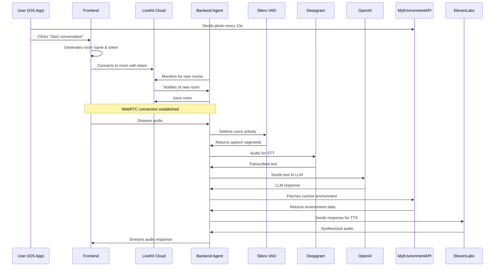

基于 WebRTC 技术、AI 智能代理与函数调用（Function Call）的实时语音交互解决方案

```mermaid
sequenceDiagram
    participant User (iOS App)
    participant Frontend
    participant LiveKit Cloud
    participant Backend Agent
    participant Silero VAD
    participant Deepgram
    participant OpenAI
    participant MyEnvironmentAPI
    participant ElevenLabs
    
    User (iOS App)->>MyEnvironmentAPI: Sends photo every 10s
    User (iOS App)->>Frontend: Clicks "Start conversation"
    Frontend->>Frontend: Generates room name & token
    Frontend->>LiveKit Cloud: Connects to room with token
    Backend Agent->>LiveKit Cloud: Monitors for new rooms
    LiveKit Cloud->>Backend Agent: Notifies of new room
    Backend Agent->>LiveKit Cloud: Joins room
    Note over Frontend,Backend Agent: WebRTC connection established
    Frontend->>Backend Agent: Streams audio
    Backend Agent->>Silero VAD: Detects voice activity
    Silero VAD->>Backend Agent: Returns speech segments
    Backend Agent->>Deepgram: Audio for STT
    Deepgram->>Backend Agent: Transcribed text
    Backend Agent->>OpenAI: Sends text to LLM
    OpenAI->>Backend Agent: LLM response
    Backend Agent->>MyEnvironmentAPI: Fetches current environment
    MyEnvironmentAPI->>Backend Agent: Returns environment data
    Backend Agent->>ElevenLabs: Sends response for TTS
    ElevenLabs->>Backend Agent: Synthesized audio
    Backend Agent->>Frontend: Streams audio response
```
